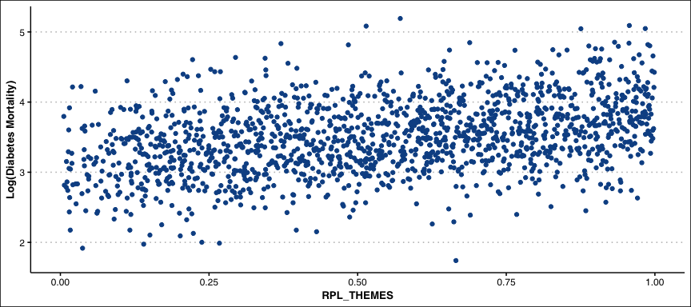

<!-- README.md is generated from README.Rmd. Please edit that file -->

# svi

<!-- badges: start -->

[](https://github.com/YimingMiao/svi/actions/workflows/R-CMD-check.yaml)
[](https://app.codecov.io/gh/YimingMiao/svi?branch=main)
[](https://github.com/YimingMiao/svi/actions/workflows/lint.yaml)
[](https://github.com/YimingMiao/svi/actions/workflows/test-coverage.yaml)
<!-- badges: end -->

## Installation

You can install the development version of svi from
[GitHub](https://github.com/) with:

``` r
# install.packages("devtools")
devtools::install_github("YimingMiao/svi")
```

## Description

`svi` provides tools to study the relationship between social
vulnerability index and disease mortality. The package contains two
datasets: `vulnerability` and `diabetes`, and relevant functions to
conduct basic data cleaning and visualizations.

## Example

This is a basic example which shows you how to solve a common problem:

-   Attach required packages

``` r
library(svi)
library(dplyr)
#> 
#> Attaching package: 'dplyr'
#> The following objects are masked from 'package:stats':
#> 
#>     filter, lag
#> The following objects are masked from 'package:base':
#> 
#>     intersect, setdiff, setequal, union
library(purrr)
```

-   Plot US SVI Map

``` r
vulnerability |> mnnn_to_na(names(which(map_lgl(vulnerability, is.double))), -999) |>
  rename(fips = FIPS) |>
  svi_map("RPL_THEMES")
```


-   Plot US Diabetes Mortality Map

``` r
diabetes |> cr_interpolate(reliable = FALSE) |>
  rename(fips = County.Code) |>
  mortality_map("Crude.Rate")
```


-   Scatter Plot of Diabetes Mortality vs. SVI Estimates

``` r
df <- prepare(vulnerability, diabetes, reliable = FALSE)
df |> mortality_vs_svi_scatter("RPL_THEMES", "Diabetes")
```


